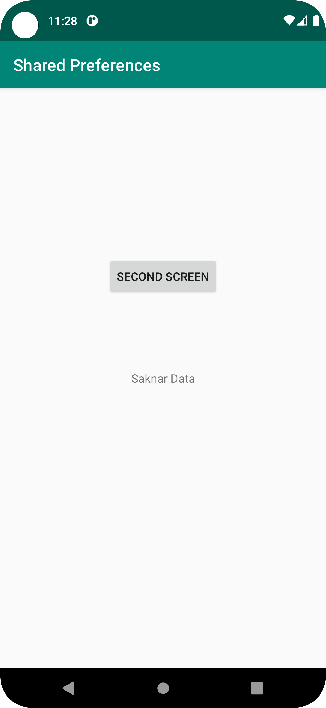
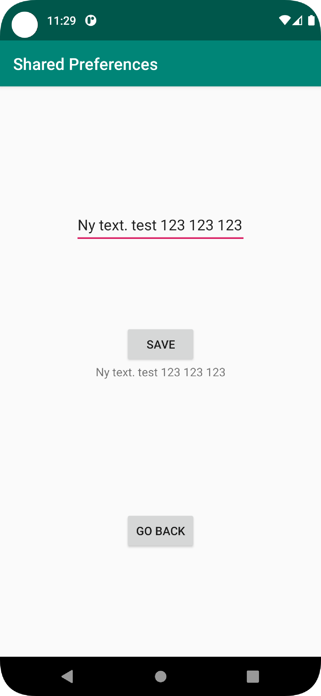
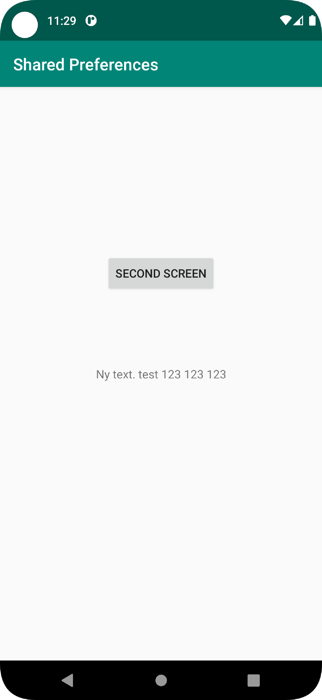

# Rapport

**Skriv din rapport här!**
Skapade knapp till main activity.
Knappen startar second activity.
```Java
         nextActivity.setOnClickListener(new View.OnClickListener() {
             @Override
             public void onClick(View view) {
             toSecondActivity();
             }
         });
    void toSecondActivity(){
        Intent intent = new Intent(this, SecondActivity.class);
        intent.putExtra("extra", "" + textToNext);
        startActivity(intent);

    }

```
När appen startas och kör koden onCreate: Ett textfält i mitten av skärmen som läser av vad som står i shared preferences, om inget finns sparat, default till "Saknar Data".
```Java

        myPreferenceRef = getSharedPreferences("SharedPreference", MODE_PRIVATE);
        myPreferenceEditor = myPreferenceRef.edit();

        String read = myPreferenceRef.getString("Reference","Saknar Data");
        text.setText(read);
```
I secondActivity finns 2 knappar, 1 textView och ett textfält där man kan skriva in text.
När man skrivit in något och klickar på save knappen syns det direkt i textView och sparas till SharedPreference.
```Java
        save.setOnClickListener(new View.OnClickListener() {
            @Override
            public void onClick(View view) {
                secondTextView.setText(editText.getText());
                myPreferenceEditor.putString("Reference", secondTextView.getText().toString());
                myPreferenceEditor.apply();

            }
        });
```
Den andra knappen gör att man går tillbaka till mainActivity.
```Java
        mySecondButton.setOnClickListener(new View.OnClickListener() {
            @Override
            public void onClick(View view) {
                goBackToMain();
            }
        });
    void goBackToMain(){
        finish();
    }
```
I mainActivity, finns onResume, som läser igen från sharedPreferences och visar upp i textview i mainActivity vad som skrevs i edit rutan och sparades i secondActivity.
```Java
    protected void onResume() {
        super.onResume();
        String read = myPreferenceRef.getString("Reference","Saknar Data");
        text.setText(read);
    }
```





Läs gärna:
